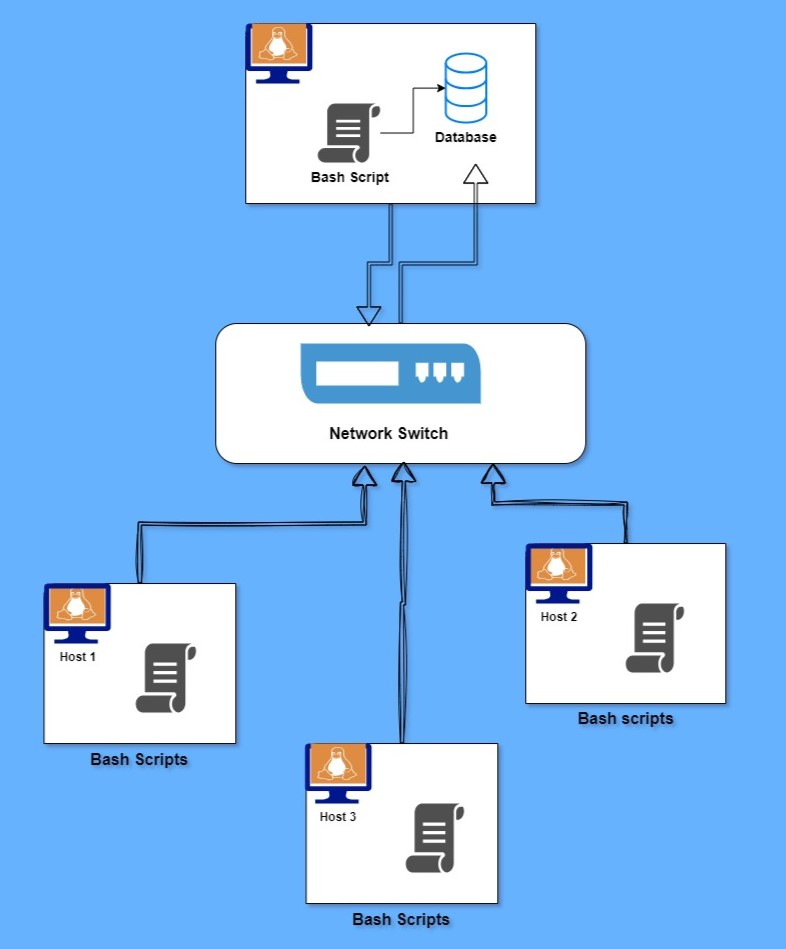

# Linux Cluster Monitoring Project

## Introduction
 
 This project is developed to support Linux CLuster Administration (LCA) team which collects data from linux cluster node for monitoring purpose, generating reports and make needful decisions. The project basically allows the team to record hardware specifications of linux nodes and its memory usage information in real time. List of potential users and technologies used are as follows :
 
 ### Users
 - Network administrators
 - Analysts
 - System Administrators
 
 ### Technologies
 - Docker
 - Shell scripts
 - PostgreSQL
 - Git
 
 ## Quick Start
- Start a psql instance using psql_docker.sh
```bash
# create a container if not exists
./scripts/psql_docker.sh start|stop|create [db_username][db_password]
# start the container
./scripts/psql_docker.sh start
# connect to a psql instance
psql -h HOST_NAME -p 5432 -U USER_NAME
```
- Create tables using ddl.sql
```sql
-- Create a host_info table
CREATE TABLE PUBLIC.host_info 
  ( 
     id               SERIAL NOT NULL, 
     hostname         VARCHAR NOT NULL, 
     cpu_number       INT2 NOT NULL, 
     cpu_architecture VARCHAR NOT NULL, 
     cpu_model        VARCHAR NOT NULL, 
     cpu_mhz          FLOAT8 NOT NULL, 
     l2_cache         INT4 NOT NULL, 
     "timestamp"      TIMESTAMP NULL, 
     total_mem        INT4 NULL, 
     CONSTRAINT host_info_pk PRIMARY KEY (id), 
     CONSTRAINT host_info_un UNIQUE (hostname) 
  );

-- Create a host_usage table
CREATE TABLE PUBLIC.host_usage 
  ( 
     "timestamp"    TIMESTAMP NOT NULL, 
     host_id        SERIAL NOT NULL, 
     memory_free    INT4 NOT NULL, 
     cpu_idle       INT2 NOT NULL, 
     cpu_kernel     INT2 NOT NULL, 
     disk_io        INT4 NOT NULL, 
     disk_available INT4 NOT NULL, 
     CONSTRAINT host_usage_host_info_fk FOREIGN KEY (host_id) REFERENCES 
     host_info(id) 
  );
```
- Insert hardware specs data into the DB using host_info.sh
```sql
insert_stmt="INSERT INTO host_info (hostname, cpu_number, cpu_architecture, cpu_model, cpu_mhz, l2_cache, timestamp, total_mem)
                VALUES('$hostname', $cpu_number, '$cpu_architecture', '$cpu_model', $cpu_mhz, $l2_cache, '$timestamp', $total_mem);"
```
- Insert hardware usage data into the DB using host_usage.sh
```sql
insert_stmt="INSERT INTO host_usage (timestamp, host_id, memory_free, cpu_idle, cpu_kernel, disk_io, disk_available)
              VALUES('$timestamp',$host_id, $memory_free, $cpu_idle, $cpu_kernel, $disk_io, $disk_available);"
```
- Crontab setup
```bash
# edit crontab jobs
bash> crontab -e
# add this to crontab
* * * * * bash /home/centos/dev/jrvs/bootcamp/linux_sql/host_agent/scripts/host_usage.sh localhost 5432 host_agent postgres password > /tmp/host_usage.log
```

## Implementation
Initially, a git repository on Github is generated to save the source code. Docker is installed on the remote desktop, through which a container gets created with proper volume to persist data.
With the help of container, PostgreSQL is pulled to make database schema. Two tables are created host_info and host_usage in the host_agent database. After setting up database, bash scripts 
are prepared to gather hardware specifications and host usage information. After this information gets inserted into database, host_usge script is automated to fetch the values within the interval of each minute.
This task is carried out with the command-line utility called crontab. It schedules the jobs at certain times ori intervals. After necessary changes, hotfixes and solving typos, the project gets deployed on github.


## Architecture
Below is the linux cluster architecture diagram consisting three linux nodes, a host agent and a database.



## Scripts

- psql_docker.sh - The script will perform creation task of the required container if not exists. It will start and stop the container according to the user needs.
```bash
# script usage
./scripts/psql_docker.sh start|stop|create [db_username][db_password]

```
- host_info.sh - This script will collect hardware specifications such as number of CPUs, Model name, Architecture and so on. It utilizes the host_info table to inject the data.
```bash
# script usage
./scripts/host_info.sh psql_host psql_port db_name psql_user psql_password
```
- host_usage.sh - It is used to get the usage information like disk I/O, available disk in MB, timestamp and much more. The script then constucts and executes INSERT statement to store data in host_usage table.
```bash
bash scripts/host_usage.sh psql_host psql_port db_name psql_user psql_password
```
- crontab - Cron is a linux utility which works like a job schedular. Host_usage.sh script is executed every minute by this utility, thus data gets added to the database within time-intervals. 
Here the five (*) states that job will run each minute.
```bash
# to execute the job at a moment, use this in CLI
bash /home/centos/dev/jrvs/bootcamp/linux_sql/host_agent/scripts/host_usage.sh localhost 5432 host_agent postgres password > /tmp/host_usage.log
```
- queries.sql  - Users will execute some SQL queries to pull out information like average usage time in percentage over one minute intervals. They can also retrieve a list of all distinct host_names which are stored in the database and fetch specific information of hosts.

## Database Modeling

1.`host_info` table schema

| Column Name | Data type | Description |
| --- | --- | --- |
| id | SERIAL | Primary key, unique identifier for each host, auto-increment
| hostname | VARCHAR | Name of the host machine
| cpu_number | INT2 | Number of CPU cores in the host
| cpu_architecture | VARCHAR | Architecture of the CPU
| cpu_model | VARCHAR |Model name of the CPU
| cpu_mhz | FLOAT8 | Speed of the CPU in MHz
| l2_cache | INT4 | Size of L2 cache in KB
| timestamp | TIMESTAMP | Time when the information was recorded
| total_mem | INT4 | Total memory in the host in KB

2.`host_usage` table schema

| Column Name | Data type | Description |
| --- | --- | --- |
| timestamp | TIMESTAMP | Time when the usage was recorded
| host_id | SERIAL | Foreign key, references to column id in `host_info`
| memory_free | INT4 | Amount of free memory in MB
| cpu_idle | INT2 | Percentage of CPU that is idle
| cpu_kernel | INT2 | Percentage of CPU used by the kernel
| disk_io | INT4 | Number of disk I/O
| disk_available | INT4 | Available disk space in MB (root directory)

## Test

After designing schema for `host_info` and `host_usage` tables. I connected to the psql instance using below command. 
```sql
psql -h localhost -U postgres -W
```

Then I have created above two tables using CREATE TABLE queries. Later, I inserted sample values into the table to test if the query is executing properly.Finally I've executed SELECT query on my tables to verify if the inserted data values are in correct format.
```sql
-- test values for `host_info table
INSERT INTO host_info (id, hostname, cpu_number, cpu_architecture, cpu_model, cpu_mhz, l2_cache, "timestamp", total_mem) VALUES(1, 'jrvs-remote-desktop-centos7-6.us-central1-a.c.spry-framework-236416.internal', 1, 'x86_64', 'Intel(R) Xeon(R) CPU @ 2.30GHz', 2300, 256, '2019-05-29 17:49:53.000', 601324);

-- test values for `host_usage table
INSERT INTO host_usage ("timestamp", host_id, memory_free, cpu_idle, cpu_kernel, disk_io, disk_available) VALUES('2019-05-29 15:00:00.000', 1, 300000, 90, 4, 2, 3);

-- Verify inserted data
SELECT * FROM host_info;
SELECT * FROM host_usage;
```
Test results of the DDL bash script are acurate. I understood that the id is auto-incrementing upon every new insertion into the table. Also, the create query are inserting valid data of the linux node and the timestamp value is in UTC format too as expected.


## Deployment

When the bash scripts, Postgresql database and docker are completed with its setup and working fine, I decided to deploy the project on github as it's efficient and provides version control system. In order to automate the project, I used crontab utlity command which works as a job scheduler. With the help of this command, I collected host usage data each minute and stored it in a database. I have also directed the output of crontab job to a temporary log for reference. All in all, through git, docker container, postgresql DB and crontab I deployed and automated the project.


##Improvements

- Integrate monitoring tools in a such  way that it can send alert for an unsual activity regarding host usage data
- I want to handle environment variables in a robust way such that every time someone try to connect to psql instance it can working without any password issues.
- Develop database backup plan, to prevent data loss.
