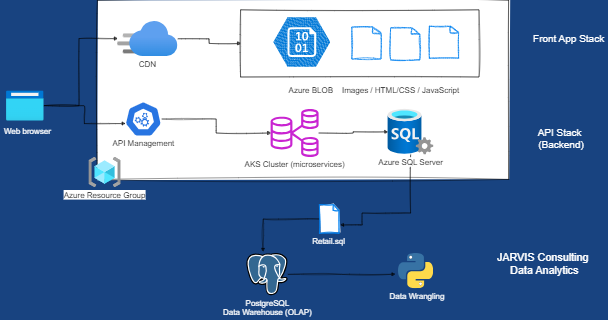

# Introduction

- London Gift Shop (LGS) is a UK based company which specializes in making gift items, primarily selling to wholesole customers.
Even though company has been in business for more than 10 years, the company's revenue hasn't been increased much. To address this problem, the LGS marketing team aims to leverage advanced data technologies to gain deeper 
insights into customer behavior, which will inform their sales and marketing strategies.
- As a Data Engineer at Jarvis, we can analyze the customer data to draw certain business results like captuirng shopping
 patterns which will help the company to focus on customer segmentation and other ways to increase the sales.
- Through these insights, the stakeholders can implement targeted marketing initiatives such as emails, promotions and other
 specialized deals to attract new as well as existing customers.
- In order to perform data analytics, Jupyter Notebook has been used. Alongwith this several Python libraries such as NumPy, Pandas DataFrame,
Matplotlib were utilized for simplying data and plot it as a charts and diagrams for better and clear understanding.

# Implementaion
## Project Architecture

- Describe the architecture of this project, including the LGS web app.
- Draw an architecture Diagram (please do not copy-paste any diagram from the project board)

## Data Analytics and Wrangling
- Create a link that points to your Jupyter notebook (use the relative path `./retail_data_analytics_wrangling.ipynb`)
- From the data dumped by 
Discuss how would you use the data to help LGS to increase their revenue (e.g. design a new marketing strategy with data you provided)

# Improvements
- List three improvements that you want to do if you got more time